# 🛡️ Sistema de Gestão de Ocorrências Policiais Integradas (SGOPI Sentinela)

## 📄 Especificação de Engenharia de Software, Requisitos, Planejamento do MVP e Modelagem Arquitetural

**Universidade Federal do Pampa (Unipampa — Campus Alegrete)**  
**Curso:** Bacharelado em Engenharia de Software  
**Disciplina Atual:** Resolução de Problemas IV (AL0343) *(Concepção inicial: Análise e Projeto de Software - AL0332)*  
**Semestre Letivo:** 2026/1  
**Corpo Docente / Orientação:** Prof. Dr. Gilleanes Thorwald Araujo Guedes / Prof. Dr. Fabio Paulo Basso  

**Equipe de Desenvolvimento:**
- **Fade Hassan Husein Kanaan**
- **Gabriel Ortiz**
- **Gustavo Fernandes dos Anjos**
- **Mateus Estivalet Valau**
- **Matheus Cabral**
- **Rodrigo Thoma da Silva**  
*(Colaboradores da modelagem conceitual original: Andreus Dean, Artur Wahlbrink, Frederico Marques)*

---

## 🧭 Sumário

1. [Especificação de Requisitos do Sistema](#1-especificação-de-requisitos-do-sistema)
   - [1.1 Requisitos Funcionais (RF01 a RF10)](#11-requisitos-funcionais)
   - [1.2 Requisitos Não Funcionais (RNF01 a RNF05)](#12-requisitos-não-funcionais)
2. [Priorização de Requisitos (Matriz MoSCoW)](#2-priorização-de-requisitos-matriz-moscow)
3. [Proposta de MVP do Software (Minimum Viable Product)](#3-proposta-de-mvp-do-software)
   - [3.1 Visão Geral e Objetivo](#31-visão-geral-e-objetivo-principal)
   - [3.2 Hipótese Técnica e Escopo da Primeira Iteração](#32-hipótese-técnica-e-escopo-da-primeira-iteração)
   - [3.3 Fluxo Funcional Ponta a Ponta](#33-fluxo-funcional-ponta-a-ponta)
   - [3.4 Critérios de Aceite e Validação do MVP](#34-critérios-de-aceite-e-validação-do-mvp)
4. [Arquitetura e Padrões de Projeto (Arquitetura Hexagonal)](#4-arquitetura-e-padrões-de-projeto)
   - [4.1 Justificativa Arquitetural e Atendimento aos RNFs](#41-justificativa-do-padrão-arquitetural-escolhido)
   - [4.2 Divisão em Camadas (Core, Ports & Adapters)](#42-divisão-em-camadas-e-módulos)
5. [Projeto do Software (Modelagem Estrutural & Comportamental)](#5-projeto-do-software)
   - [5.1 Diagrama de Casos de Uso Geral](#51-diagrama-de-casos-de-uso)
   - [5.2 Diagrama de Pacotes (Arquitetura Hexagonal)](#52-diagrama-de-pacotes)
   - [5.3 Diagramas de Componentes](#53-diagramas-de-componentes)
     - [5.3.1 Diagrama de Componentes (Versão Executável / Build & Deploy)](#531-diagrama-de-componentes-versão-executável)
     - [5.3.2 Diagrama de Componentes (Módulos Lógicos na Arq. Hexagonal)](#532-diagrama-de-componentes-módulos-lógicos-na-arquitetura-hexagonal)
   - [5.4 Diagrama de Classes de Domínio](#54-diagrama-de-classes-de-domínio)
   - [5.5 Diagrama de Implantação e Topologia](#55-diagrama-de-implantação-e-topologia)
6. [Especificação Detalhada dos Casos de Uso & Diagramas de Sequência](#6-especificação-detalhada-dos-casos-de-uso--diagramas-de-sequência)
   - [UC01 — Registrar Ocorrência Policial](#uc01--registrar-ocorrência-policial-rf01)
   - [UC02 — Despachar Viatura Tática](#uc02--despachar-viatura-tática-rf02)
   - [UC03 — Lavrar Auto de Apreensão](#uc03--lavrar-auto-de-apreensão-rf03)
   - [UC04 — Validar Ocorrência](#uc04--validar-ocorrência-rf04)
   - [UC05 — Monitorar Manchas Criminais e Alertas](#uc05--monitorar-manchas-criminais-e-alertas-rf05)
   - [UC06 — Vincular Ocorrências a Inquéritos](#uc06--vincular-ocorrências-a-inquéritos-rf06)
   - [UC07 — Manter Laudos Periciais](#uc07--manter-laudos-periciais-rf07)
   - [UC08 — Autenticar Documento Policial](#uc08--autenticar-documento-policial-rf08)
   - [UC09 — Manter Medidas Protetivas](#uc09--manter-medidas-protetivas-rf09)
   - [UC10 — Comunicação Interagências](#uc10--comunicação-interagências-rf10)
   - [UC11 — Emitir Alerta de Criticidade](#uc11--emitir-alerta-de-criticidade-rf05)
   - [UC12 — Emitir Alerta de Vencimento de Medida](#uc12--emitir-alerta-de-vencimento-de-medida-rf09)

---

## 1. Especificação de Requisitos do Sistema

### 1.1 Requisitos Funcionais

| ID | Requisito | Descrição Detalhada |
| :--- | :--- | :--- |
| **RF01** | **Gestão de Ocorrência Policial** | O sistema deve permitir o registro integral de ocorrências policiais, incluindo a descrição circunstanciada do fato, a qualificação completa dos envolvidos (vítimas, testemunhas, suspeitos) e o armazenamento permanente de evidências digitais anexadas. |
| **RF02** | **Monitoramento e Despacho Tático de Resposta** | O sistema deve permitir que a central de comando visualize a localização das viaturas em tempo real e emita ordens de serviço (despacho) para as unidades mais próximas ao local de uma ocorrência registrada. |
| **RF03** | **Gestão de Inventário de Apreensões** | O sistema deve registrar todos os objetos, armas, veículos ou substâncias apreendidas, mantendo a cadeia de custódia e vinculação unívoca à ocorrência de origem. |
| **RF04** | **Fluxo de Aprovação e Revisão** | O sistema deve permitir que um Delegado ou autoridade policial superior revise, solicite correções formais ou valide a ocorrência lavrada pelo Agente. |
| **RF05** | **Inteligência Criminal e Alertas Georreferenciados** | O sistema deve gerar visualizações gráficas de *manchas criminais* e, de forma integrada, emitir alertas automáticos para supervisores baseados em gatilhos de alta criticidade (reincidência de suspeitos na semana ou aumento expressivo de crimes em área geográfica num intervalo de 24h). |
| **RF06** | **Gestão de Inquéritos e Vinculação de Ocorrências** | O sistema deve permitir agrupar múltiplas ocorrências sob um mesmo inquérito policial, identificando automaticamente possíveis conexões entre casos por critérios como suspeitos em comum, localização, *modus operandi* ou intervalo temporal. |
| **RF07** | **Gestão de Laudos Periciais** | O sistema deve permitir a solicitação, o acompanhamento do status pericial e a anexação segura de laudos emitidos pela Polícia Científica/Instituto de Perícias com validação de assinatura digital. |
| **RF08** | **Autenticação e Validação Pública de Documentos** | O sistema deve disponibilizar funcionalidade pública para que órgãos externos, órgãos judiciais ou cidadãos validem a autenticidade e integridade de documentos emitidos (Boletim de Ocorrência, certidões) por meio de chave de segurança alfanumérica ou QR Code. |
| **RF09** | **Gestão de Medidas Protetivas e Restrições** | O sistema deve permitir o registro, controle de prazos e monitoramento ativo de medidas protetivas de urgência ou restrições judiciais vinculadas a indivíduos, emitindo alertas automáticos de vencimento próximo (72h antes). |
| **RF10** | **Comunicação Interagências** | O sistema deve possuir módulo de comunicação oficial interna e sigilosa que permita a troca formal de mensagens, despachos e documentos entre diferentes departamentos policiais (Polícia Civil, Militar e Perícia Técnica) vinculados a um número de protocolo. |

*\*Manchas criminais: Representações visuais da densidade e concentração de ocorrências em uma região geográfica específica, utilizadas para direcionar policiamento ostensivo e inteligência preventiva.*

---

### 1.2 Requisitos Não Funcionais

Nesta seção, estabelecem-se os requisitos não funcionais que norteiam os direcionadores arquiteturais do SGOPI Sentinela.

| ID | Requisito | Categoria | Descrição Arquitetural |
| :--- | :--- | :--- | :--- |
| **RNF01** | **Desempenho e Tempo Real** | Desempenho / Escalabilidade | O sistema deve processar dados georreferenciados dinamicamente, exibindo mapas de manchas criminais atualizados e monitorando a localização GPS das viaturas para cálculo de proximidade e despacho tático com latência mínima via WebSockets e mensageria assíncrona. |
| **RNF02** | **Proteção e Controle de Acesso** | Segurança / RBAC | O sistema deve garantir controle rigoroso de acesso baseado em papéis (*Role-Based Access Control* — Agente, Delegado, Perito, Operador de Central, Supervisor, Cidadão), além de proteger a privacidade ocultando dados sensíveis dos envolvidos no módulo de consulta pública. |
| **RNF03** | **Segurança, Imutabilidade e Auditoria** | Confiabilidade / Compliance | O sistema deve assegurar a integridade e imutabilidade de documentos oficiais (autos de apreensão, boletins, laudos periciais) e mensagens interagências, os quais não podem ser excluídos, permitindo apenas retificações auditadas. Deve manter logs inalteráveis de todas as operações sensíveis. |
| **RNF04** | **Confiabilidade e Tolerância a Falhas** | Resiliência | O sistema deve possuir rotinas de contingência para operar de forma resiliente: em falha de GPS, bloqueia-se o despacho automático e permite-se seleção manual por última posição conhecida; em falha no mapa, exibe-se a listagem tabular; e timeouts em integrações geram retentativas e logs de erro. |
| **RNF05** | **Manutenibilidade e Desacoplamento** | Arquitetura / Evolução | A arquitetura deve isolar as regras de negócio puras (domínio e casos de uso) de qualquer dependência tecnológica externa (frameworks, SGBD, provedores de mapas, mensageria), viabilizada pela adoção da Arquitetura Hexagonal (*Ports & Adapters*). |

---

## 2. Priorização de Requisitos (Matriz MoSCoW)

A priorização seguiu critérios técnicos de viabilidade, dependência funcional e valor de entrega para a Engenharia de Software:

| Categoria | ID | Requisito | Justificativa de Engenharia |
| :--- | :--- | :--- | :--- |
| **Must Have** *(MVP Essencial)* | **RF01** | Gestão de Ocorrência Policial | Núcleo de entrada de dados; indispensável para alimentar todo o ecossistema e entidades de domínio. |
| **Must Have** *(MVP Essencial)* | **RF04** | Fluxo de Aprovação e Revisão | Garante o ciclo de validação formal pelo Delegado antes do encaminhamento tático e formalização jurídica. |
| **Must Have** *(MVP Essencial)* | **RF02** | Monitoramento e Despacho Tático | Valida a integração em tempo real entre backend, cálculo de distância, simulador de GPS e painel tático. |
| **Should Have** *(Alta Prioridade)* | **RF03** | Gestão de Inventário de Apreensões | Inicia a formalização jurídica de bens e a cadeia de custódia vinculada à ocorrência. |
| **Should Have** *(Alta Prioridade)* | **RF05** | Inteligência Criminal e Manchas Criminais | Introduz cálculo georreferenciado e aplicação de inteligência sobre grandes volumes de dados criminais. |
| **Should Have** *(Alta Prioridade)* | **RF07** | Gestão de Laudos Periciais | Integra a Polícia Científica ao fluxo pericial através de anexação de laudos técnicos assinados digitalmente. |
| **Could Have** *(Média Prioridade)* | **RF06** | Gestão de Inquéritos e Vinculação | Agrupa ocorrências com identificação automática de padrões criminais complexos. |
| **Could Have** *(Média Prioridade)* | **RF08** | Autenticação Pública de Documentos | Portal público de consulta via chave alfanumérica/QR Code sem necessidade de login. |
| **Could Have** *(Média Prioridade)* | **RF09** | Medidas Protetivas e Restrições | Monitoramento de prazos judiciais e disparador de alertas de vencimento em 72h. |
| **Won't Have** *(Próximos Ciclos)* | **RF10** | Comunicação Interagências | Canal de mensageria sigilosa entre departamentos, estruturado como módulo de expansão futura. |

---

## 3. Proposta de MVP do Software

### 3.1 Visão Geral e Objetivo Principal

O objetivo do MVP do **SGOPI Sentinela** é validar o fluxo técnico e operacional ponta a ponta: desde a captura estruturada dos dados de uma ocorrência, sua validação pelo Delegado, até a exibição de viaturas no mapa e execução do despacho tático com coordenadas simuladas em tempo real.

```
[Agente Policial]
       │ (1. Registra Ocorrência)
       ▼
[Núcleo SGOPI - Core Domain] ─── (Persistência: 'Aguardando Revisão')
       │
       ▼
[Delegado de Polícia]
       │ (2. Revisa e Valida Ocorrência)
       ▼
[Status: 'Validada'] ─── (Notificação em Tempo Real via WebSocket)
       │
       ▼
[Operador de Central]
       │ (3. Visualiza Viaturas em Tempo Real no Mapa Tático)
       │ (4. Despacha Viatura mais Próxima calculada pelo Sistema)
       ▼
[Ordem de Despacho Gerada] ─── (Viatura Em Deslocamento)
```

### 3.2 Hipótese Técnica e Escopo da Primeira Iteração

* **Hipótese Técnica:** Uma arquitetura baseada em portas e adaptadores (*Hexagonal*) associada a WebSockets permite que o núcleo de domínio permaneça desacoplado, suportando atualizações contínuas de telemetria GPS sem comprometer a integridade transacional do banco de dados relacional.
* **Escopo Incluído no MVP:**
  - Registro completo de ocorrência com múltiplos envolvidos e tipificação de crime;
  - Máquina de estados da ocorrência (`Rascunho` -> `Aguardando Revisão` -> `Validada` / `Rejeitada` -> `Em Despacho` -> `Concluída`);
  - Módulo de revisão exclusiva para Delegado;
  - Painel tático em tempo real com mapa interativo (Leaflet / OpenStreetMap);
  - Serviço de simulação de telemetria GPS emitindo coordenadas periódicas para as viaturas ativas;
  - Cálculo de proximidade (algoritmo euclidiano / Haversine) e emissão de ordem de despacho.
* **Limites do MVP (O que NÃO entra no primeiro ciclo):**
  - Upload de arquivos multimídia pesados (áudio/vídeo pericial);
  - Geração de PDF com carimbo de tempo ICP-Brasil;
  - Integração com hardware real de GPS vehicular (utilizar-se-á simulador HTTP/WebSocket);
  - Módulo de comunicação interagências e inquéritos consolidados.

### 3.3 Fluxo Funcional Ponta a Ponta

1. **Passo 1 (Registro):** O Agente autentica-se, preenche o formulário de ocorrência com endereço, narrativa dos fatos e envolvidos. O sistema persiste no banco com status `Aguardando Revisão`.
2. **Passo 2 (Revisão):** O Delegado acessa a fila de triagem, inspeciona a ocorrência e clica em `Validar`. O sistema atualiza o status para `Validada` e dispara evento de domínio.
3. **Passo 3 (Telemetria & Mapa):** O simulador de viaturas envia coordenadas via WebSocket. O painel do Operador da Central renderiza os marcadores dinamicamente.
4. **Passo 4 (Despacho):** O Operador seleciona a ocorrência validada; o sistema calcula e sugere as 3 viaturas mais próximas; o Operador confirma o despacho e a viatura tem seu status alterado para `Em Deslocamento`.

### 3.4 Critérios de Aceite e Validação do MVP

- [x] Ocorrência registrada persiste com chave única e integridade referencial de todos os envolvidos.
- [x] Somente perfis autenticados com papel `Delegado` conseguem alterar o status para `Validada`.
- [x] Viaturas atualizam suas posições no mapa com latência inferior a 1 segundo via WebSocket sem necessidade de *refresh* de página.
- [x] Em caso de falha de conexão do sinal GPS, o sistema exibe alerta e disponibiliza a listagem tabular das viaturas com a última posição conhecida.
- [x] A ordem de despacho registra com precisão: data/hora, operador responsável, viatura designada e identificador da ocorrência.

---

## 4. Arquitetura e Padrões de Projeto

### 4.1 Justificativa do Padrão Arquitetural Escolhido

O padrão adotado é a **Arquitetura Hexagonal (*Ports & Adapters*)**. Essa escolha decorre diretamente da necessidade de atender aos requisitos não funcionais:

* **Manutenibilidade e Desacoplamento (RNF05):** O núcleo de domínio (`domain/entities` e `application/usecases`) não possui nenhuma importação ou dependência de frameworks web, drivers de banco de dados ou bibliotecas externas de mapas.
* **Desempenho e Tempo Real (RNF01):** Adaptadores de entrada via WebSockets integram o mapa tático, enquanto adaptadores de saída comunicam-se de forma reativa com o repositório de telemetria.
* **Proteção e Controle de Acesso (RNF02):** A checagem de permissões e papéis é aplicada nas portas de entrada e orquestrada nos casos de uso antes da invocação das entidades de domínio.
* **Segurança e Auditoria (RNF03):** Toda operação de negócio passa por portas de serviço que acionam adaptadores de auditoria imutáveis.
* **Confiabilidade e Resiliência (RNF04):** Falhas em APIs externas de mapas ou GPS são interceptadas e tratadas nos adaptadores secundários com estratégias de fallback (*graceful degradation*), impedindo que exceções externas quebrem o domínio.

### 4.2 Divisão em Camadas e Módulos

```
                    ┌─────────────────────────────────────────────────────────┐
                    │                   ADAPTADORES DE ENTRADA                │
                    │        (Controllers REST, WebSockets, CLI, UI)          │
                    └────────────────────────────┬────────────────────────────┘
                                                 │
                                                 ▼
                    ┌─────────────────────────────────────────────────────────┐
                    │               PORTAS DE ENTRADA (Inbound)               │
                    │   (InterfaceRegistrarOcorrencia, InterfaceDespacho, ...)│
                    └────────────────────────────┬────────────────────────────┘
                                                 │
                                                 ▼
                    ┌─────────────────────────────────────────────────────────┐
                    │                  NÚCLEO DA APLICAÇÃO                    │
                    │  ┌───────────────────────────────────────────────────┐  │
                    │  │      Casos de Uso (Application / Use Cases)       │  │
                    │  └─────────────────────────┬─────────────────────────┘  │
                    │                            │                            │
                    │  ┌─────────────────────────▼─────────────────────────┐  │
                    │  │        Entidades de Domínio & Regras Puras        │  │
                    │  │   (Ocorrencia, Viatura, Inquerito, Laudo, ...)    │  │
                    │  └───────────────────────────────────────────────────┘  │
                    └────────────────────────────┬────────────────────────────┘
                                                 │
                                                 ▼
                    ┌─────────────────────────────────────────────────────────┐
                    │               PORTAS DE SAÍDA (Outbound)                │
                    │   (RepositorioOcorrencia, PortaGPS, PortaAuditoria)     │
                    └────────────────────────────┬────────────────────────────┘
                                                 │
                                                 ▼
                    ┌─────────────────────────────────────────────────────────┐
                    │                  ADAPTADORES DE SAÍDA                   │
                    │     (JPA / Hibernate / PostgreSQL, ServicoMapasOSM,     │
                    │          SimuladorGPS, AssinaturaDigitalPDF)            │
                    └─────────────────────────────────────────────────────────┘
```

---

## 5. Projeto do Software

Esta seção reúne a modelagem visual do **SGOPI Sentinela**, cobrindo a visão de casos de uso, arquitetura lógica, artefatos executáveis, classes de domínio e topologia física de implantação.

---

### 5.1 Diagrama de Casos de Uso

O Diagrama de Casos de Uso consolida todos os atores do ecossistema policial e suas interações com as funcionalidades do sistema:

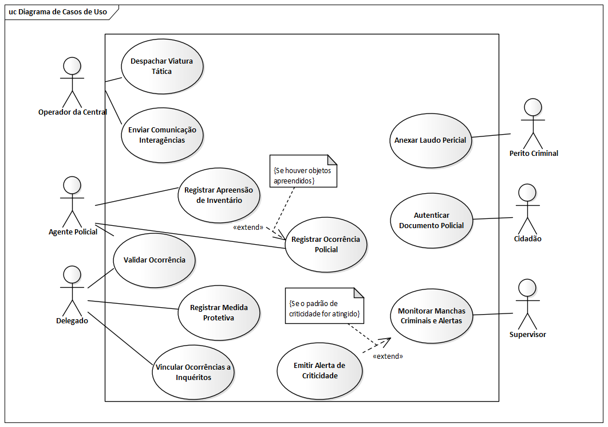

---

### 5.2 Diagrama de Pacotes

O Diagrama de Pacotes formaliza a separação estrita da Arquitetura Hexagonal em **Core (Domínio e Aplicação)**, **Ports (Entrada e Saída)** e **Adapters (Inbound e Outbound)**:

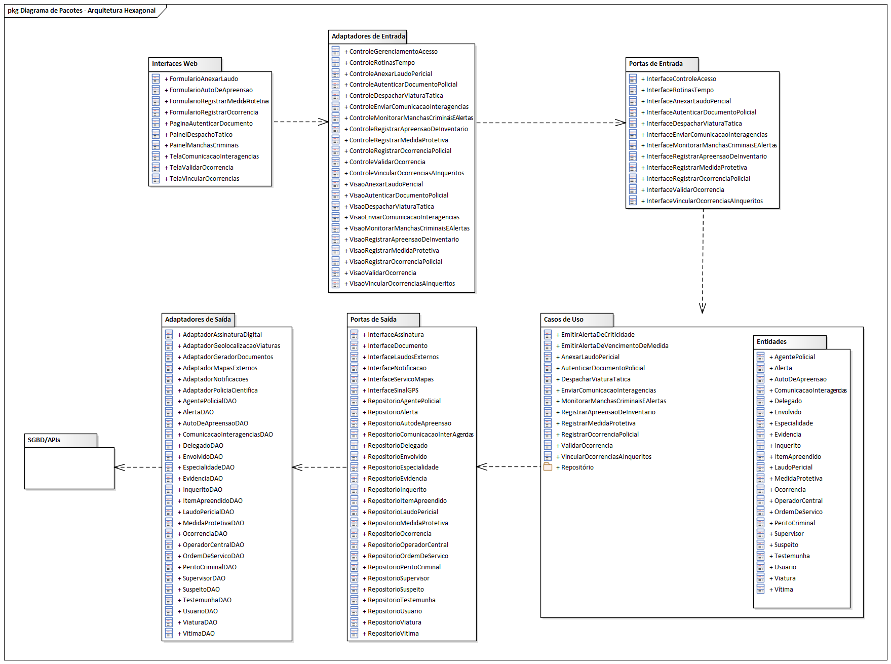

---

### 5.3 Diagramas de Componentes

Conforme as diretrizes de projeto de software, foram elaboradas duas visões complementares de componentes:

#### 5.3.1 Diagrama de Componentes (Versão Executável)
Representa a visão de empacotamento, implantação de arquivos, bibliotecas e contêineres necessários para compilar e executar o software:

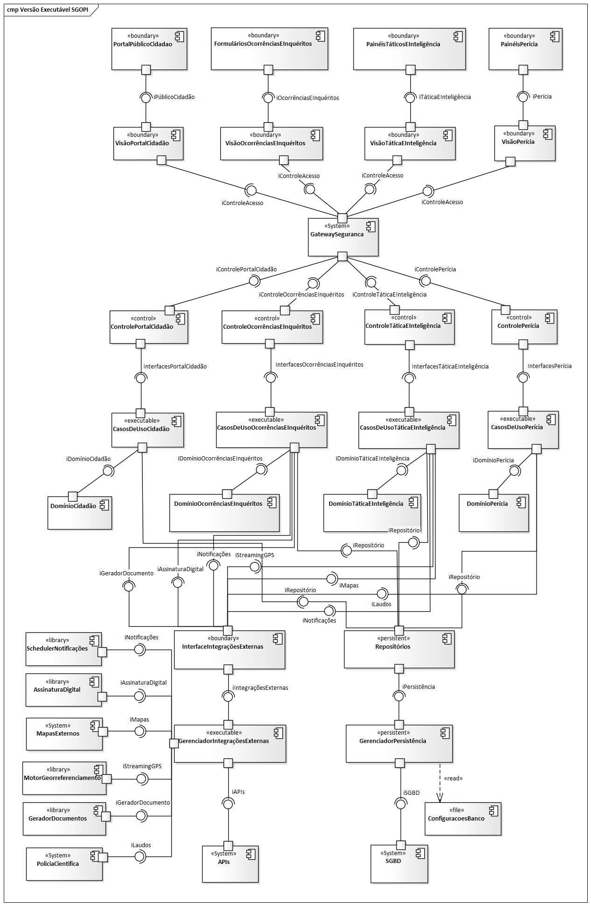

#### 5.3.2 Diagrama de Componentes (Módulos Lógicos na Arquitetura Hexagonal)
Estruturado dentro do diagrama de pacotes, reflete os módulos lógicos do software, as portas de acoplamento (*ports*) e seus respectivos adaptadores (*adapters*):

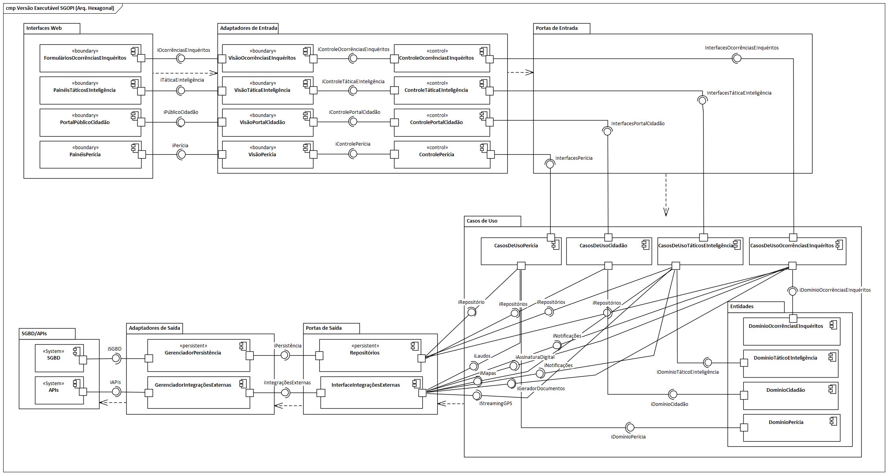

---

### 5.4 Diagrama de Classes de Domínio

O Diagrama de Classes de Domínio detalha o modelo conceitual orientado a objetos com suas entidades, atributos, relacionamentos, enumerações e multiplicidades:

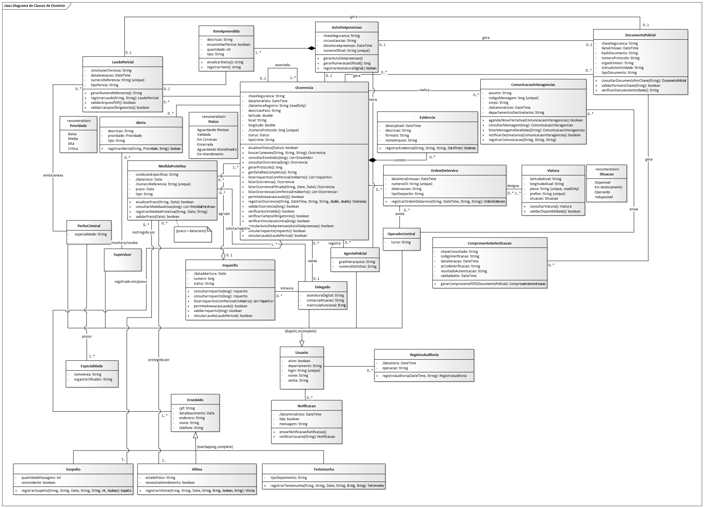

---

### 5.5 Diagrama de Implantação e Topologia

Apresenta a distribuição física e lógica dos nós de processamento, servidores de aplicação, banco de dados, mensageria e terminais de usuários:

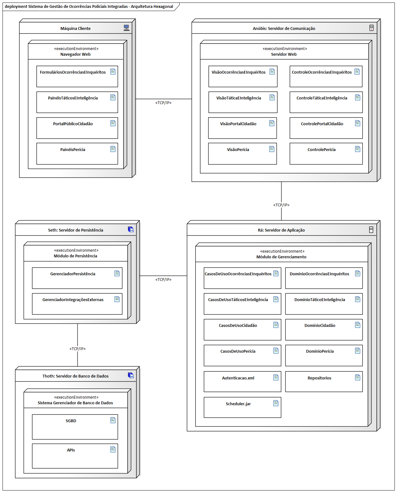

---

## 6. Especificação Detalhada dos Casos de Uso & Diagramas de Sequência

> [!NOTE]
> Em conformidade com o projeto de software, os fluxos comportamentais são especificados de forma canônica por meio da **tabela de caso de uso (Cenário Principal, Alternativos e Exceções)** acompanhada diretamente pelo seu respectivo **Diagrama de Sequência UML**, conferindo máximo rigor e clareza na troca de mensagens entre atores, adaptadores e entidades.

---

### UC01 — Registrar Ocorrência Policial (RF01)

* **Identificação:** UC01 — Registrar Ocorrência Policial
* **Resumo:** Descreve as etapas realizadas pelo Agente Policial para o registro integral de uma ocorrência, incluindo a descrição do fato, a qualificação dos envolvidos (vítimas, testemunhas, suspeitos) e o armazenamento de evidências digitais vinculadas.
* **Ator Principal:** Agente Policial
* **Atores Secundários:** —
* **Pré-condições:** O Agente Policial deve estar autenticado no sistema.
* **Pós-condições:** A ocorrência é salva no sistema com número de protocolo gerado e status inicial `Aguardando Revisão` para análise do Delegado.

#### Cenário Principal

| Passo | Ações do Ator | Ações do Sistema |
| :---: | :--- | :--- |
| 1 | Acessar o módulo de ocorrências e selecionar a opção para registrar uma nova ocorrência. | |
| 2 | | Exibir o formulário em branco contendo seções para: Fato, Envolvidos e Evidências. |
| 3 | Preencher os dados gerais e a descrição completa do fato ocorrido. | |
| 4 | Inserir a qualificação dos envolvidos, categorizando-os corretamente (vítimas, testemunhas ou suspeitos). | |
| 5 | Fazer o upload de arquivos para o armazenamento de evidências digitais (opcional). | |
| 6 | Submeter a ocorrência para finalização. | |
| 7 | | Validar o preenchimento de todos os campos obrigatórios. |
| 8 | | Persistir os dados da ocorrência com status `Aguardando Revisão`. |
| 9 | | Gerar número de protocolo único e exibir mensagem de sucesso com comprovante. |

#### Regras de Negócio e Validações
1. A descrição do fato e a qualificação de no mínimo um envolvido são de preenchimento obrigatório.
2. O sistema deve garantir que as evidências digitais fiquem permanentemente vinculadas à ocorrência gerada.
3. Toda ocorrência recém-criada assume compulsoriamente o status `Aguardando Revisão`.

#### Cenários Alternativos e de Exceção
* **Cenário Alternativo I — Registro de Apreensão Concomitante:** O Agente opta por registrar itens apreendidos durante o fluxo de registro, acionando o UC03 (Lavrar Auto de Apreensão).
* **Cenário de Exceção I — Campos Obrigatórios Não Preenchidos:** O sistema destaca os campos faltantes e bloqueia a submissão até o devido preenchimento.
* **Cenário de Exceção II — Formato de Arquivo Inválido:** O sistema rejeita arquivos não suportados (ex: `.exe`, `.bat` ou corrompidos) e solicita novo arquivo em formato aceito (`.pdf`, `.jpg`, `.png`).

#### Diagrama de Sequência — UC01
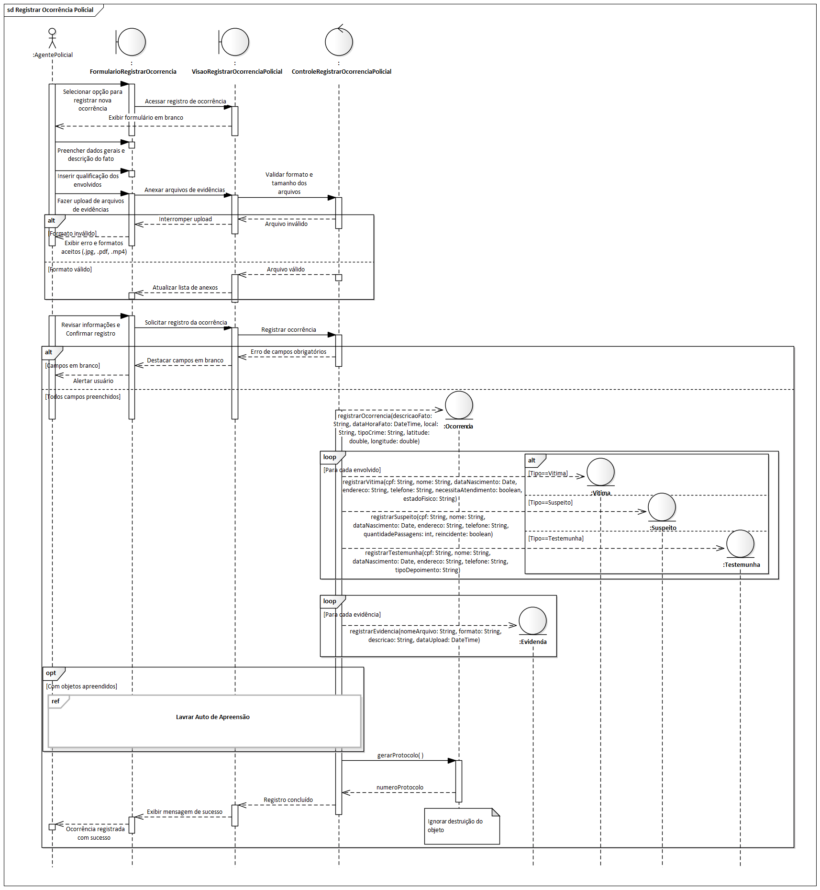

---

### UC02 — Despachar Viatura Tática (RF02)

* **Identificação:** UC02 — Despachar Viatura Tática
* **Resumo:** Descreve o fluxo pelo qual o Operador da Central de Comando monitora viaturas ativas no mapa em tempo real e despacha a unidade mais adequada para atender uma ocorrência validada.
* **Ator Principal:** Operador da Central
* **Atores Secundários:** Viatura Policial (equipe em campo)
* **Pré-condições:** 
  1. Uma ocorrência deve estar registrada com status `Validada`.
  2. O serviço de telemetria GPS das viaturas deve estar ativo comunicando com o backend.
* **Pós-condições:** 
  1. A viatura selecionada recebe a ordem de serviço e assume status `Em Deslocamento`.
  2. A ocorrência assume status `Em Atendimento`.

#### Cenário Principal

| Passo | Ações do Ator | Ações do Sistema |
| :---: | :--- | :--- |
| 1 | Acessar o painel de monitoramento tático. | |
| 2 | | Carregar o mapa com as ocorrências pendentes e a localização das viaturas em tempo real. |
| 3 | Selecionar a ocorrência pendente a ser atendida. | |
| 4 | | Calcular e ordenar as viaturas disponíveis mais próximas com base na distância geodésica. |
| 5 | Selecionar a viatura desejada e confirmar a emissão da ordem de despacho. | |
| 6 | | Validar a disponibilidade da viatura selecionada. |
| 7 | | Alterar o status da viatura para `Em Deslocamento` e da ocorrência para `Em Atendimento`. |
| 8 | | Transmitir a ordem de serviço em tempo real para o terminal da viatura. |
| 9 | | Registrar o evento de despacho no log de auditoria com carimbo de data/hora. |

#### Regras de Negócio e Validações
1. Apenas viaturas com status `Disponível` podem receber ordem de despacho.
2. Apenas ocorrências previamente validadas pelo Delegado podem ser despachadas.
3. O cálculo de proximidade deve considerar a última coordenada GPS válida recebida nos últimos 60 segundos.

#### Cenários Alternativos e de Exceção
* **Cenário Alternativo I — Despacho de Múltiplas Viaturas:** O Operador seleciona mais de uma viatura de apoio para ocorrências de alta gravidade.
* **Cenário de Exceção I — Falha no Sinal de GPS da Viatura (RNF04):** O sistema detecta sinal de GPS desatualizado (> 60s), sinaliza no mapa em amarelo, bloqueia o despacho automático e permite ao Operador selecionar a unidade manualmente por posição informada via rádio.
* **Cenário de Exceção II — Nenhuma Viatura Disponível:** O sistema notifica o Operador da Central e mantém a ocorrência na fila de prioridade máxima.

#### Diagrama de Sequência — UC02
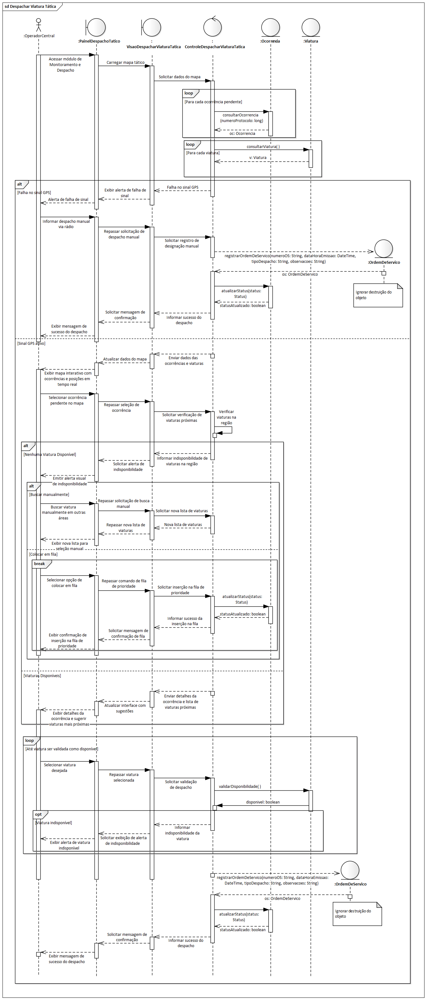

---

### UC03 — Lavrar Auto de Apreensão (RF03)

* **Identificação:** UC03 — Lavrar Auto de Apreensão
* **Resumo:** Descreve o registro e a formalização dos bens, armas, substâncias ou veículos apreendidos em uma ocorrência, garantindo a rastreabilidade e a cadeia de custódia.
* **Ator Principal:** Agente Policial
* **Atores Secundários:** —
* **Pré-condições:** A ocorrência de referência deve estar em andamento ou registrada.
* **Pós-condições:** O auto de apreensão é gerado com número de lacre e tombamento, vinculado permanentemente à ocorrência.

#### Cenário Principal

| Passo | Ações do Ator | Ações do Sistema |
| :---: | :--- | :--- |
| 1 | Acessar a ocorrência e selecionar a opção `Registrar Auto de Apreensão`. | |
| 2 | | Exibir formulário de apreensão com campos de descrição, tipo de item, quantidade e número de lacre. |
| 3 | Informar a categoria do item (arma de fogo, entorpecente, veículo, valor, objeto) e suas características. | |
| 4 | Informar o número do lacre de segurança e o local de custódia temporária. | |
| 5 | Confirmar a inclusão do item no auto. | |
| 6 | | Validar os campos obrigatórios e registrar o item na lista de apreensões. |
| 7 | Finalizar o auto de apreensão. | |
| 8 | | Gerar o documento de Auto de Apreensão com identificador único e vincular à ocorrência. |

#### Regras de Negócio e Validações
1. Todo item apreendido deve obrigatoriamente possuir descrição, quantidade, estado de conservação e número de lacre.
2. Itens do tipo `Arma de Fogo` exigem preenchimento de calibre, marca e número de série (se legível).
3. Após a homologação do auto, os itens não podem ser excluídos, permitindo apenas aditamentos auditados.

#### Cenários Alternativos e de Exceção
* **Cenário Alternativo I — Solicitação de Perícia Imediata:** O Agente marca o item apreendido com a flag `Requer Perícia`, disparando automaticamente a pré-solicitação pericial no UC07.
* **Cenário de Exceção I — Lacre Já Cadastrado:** O sistema valida a unicidade do lacre e rejeita números duplicados na base.

#### Diagrama de Sequência — UC03
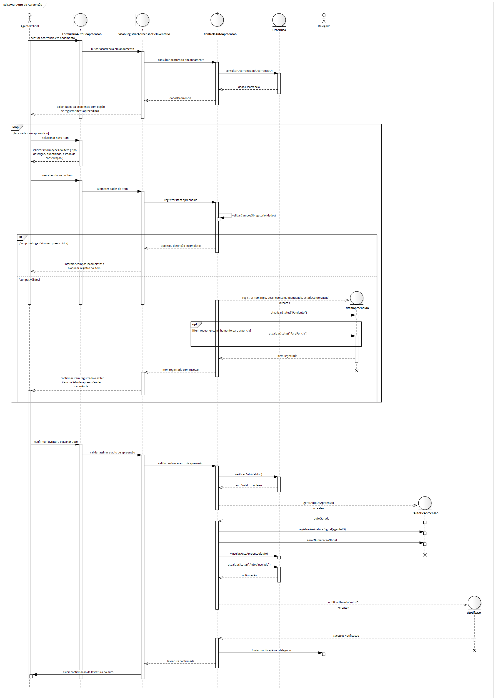

---

### UC04 — Validar Ocorrência (RF04)

* **Identificação:** UC04 — Validar Ocorrência
* **Resumo:** Descreve a revisão formal e o julgamento técnico-jurídico realizado pelo Delegado de Polícia sobre uma ocorrência lavrada pelo Agente.
* **Ator Principal:** Delegado de Polícia
* **Atores Secundários:** Agente Policial (notificado do resultado)
* **Pré-condições:** A ocorrência deve estar com status `Aguardando Revisão`.
* **Pós-condições:** A ocorrência passa para o status `Validada` (liberada para despacho e inquérito) ou `Rejeitada / Em Correção` com despacho fundamentado.

#### Cenário Principal

| Passo | Ações do Ator | Ações do Sistema |
| :---: | :--- | :--- |
| 1 | Acessar a fila de ocorrências pendentes de revisão. | |
| 2 | | Listar todas as ocorrências com status `Aguardando Revisão` ordenadas por antiguidade e gravidade. |
| 3 | Selecionar uma ocorrência para análise. | |
| 4 | | Exibir todos os detalhes: narrativa, envolvidos, evidências e autos de apreensão. |
| 5 | Avaliar a tipificação penal e a consistência das informações. | |
| 6 | Inserir despacho da autoridade e selecionar a opção `Validar Ocorrência`. | |
| 7 | | Atualizar o status da ocorrência para `Validada`. |
| 8 | | Assinar digitalmente o ato de validação e registrar no log de auditoria. |
| 9 | | Notificar o Agente autor e liberar o registro para o painel tático de despacho. |

#### Regras de Negócio e Validações
1. Apenas usuários com perfil formal de `Delegado` possuem permissão para executar a validação.
2. A validação gera uma chave criptográfica de integridade que impede a edição direta da narrativa do fato.
3. Caso a ocorrência seja rejeitada, o campo de justificativa técnica do Delegado torna-se obrigatório.

#### Cenários Alternativos e de Exceção
* **Cenário Alternativo I — Solicitação de Diligências / Correção:** O Delegado identifica inconsistências e devolve a ocorrência com status `Em Correção`, descrevendo as pendências a serem sanadas pelo Agente.
* **Cenário de Exceção I — Tentativa de Validação por Perfil Não Autorizado:** O sistema bloqueia a ação, emite alerta de segurança (RNF02) e registra a tentativa no log de auditoria.

#### Diagrama de Sequência — UC04
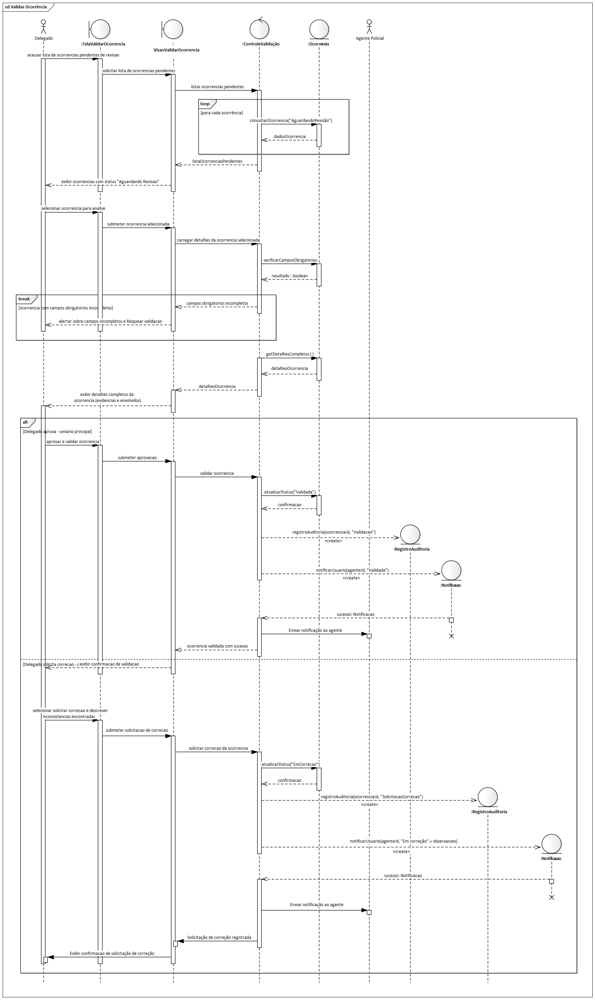

---

### UC05 — Monitorar Manchas Criminais e Alertas (RF05)

* **Identificação:** UC05 — Monitorar Manchas Criminais e Alertas
* **Resumo:** Descreve a geração e a visualização espacial de manchas criminais através de agrupamento georreferenciado e densidade de calor de ocorrências registradas em determinado período.
* **Ator Principal:** Supervisor / Analista de Inteligência
* **Atores Secundários:** —
* **Pré-condições:** Ocorrências georreferenciadas registradas no banco de dados.
* **Pós-condições:** O mapa exibe as manchas criminais e as métricas de densidade calculadas.

#### Cenário Principal

| Passo | Ações do Ator | Ações do Sistema |
| :---: | :--- | :--- |
| 1 | Acessar o módulo de Inteligência Criminal. | |
| 2 | Selecionar os filtros desejados (período, tipificação penal, bairro/região). | |
| 3 | Solicitar a geração do mapa de calor de manchas criminais. | |
| 4 | | Consultar os registros de ocorrências correspondentes aos filtros aplicados. |
| 5 | | Executar o algoritmo de densidade espacial (Kernel Density Estimation / Heatmap). |
| 6 | | Renderizar a camada gráfica de manchas criminais sobre o mapa interativo. |
| 7 | | Exibir painel lateral com estatísticas de incidência e comparação com períodos anteriores. |

#### Regras de Negócio e Validações
1. Ocorrências sem coordenadas geográficas válidas são computadas em indicador de pendência cadastral.
2. O sistema deve permitir a sobreposição de camadas: manchas criminais, viaturas ativas e divisões de setores policiais.

#### Cenários Alternativos e de Exceção
* **Cenário Alternativo I — Disparo de Alerta Automático de Criticidade:** Se durante o processamento o sistema detectar aumento superior a 20% em 24h em uma área ou suspeito reincidente, invoca o UC11 (Emitir Alerta de Criticidade).
* **Cenário de Exceção I — Falha no Servidor de Mapas (RNF04):** O sistema exibe os dados em formato de relatório analítico tabular com endereços e bairros.

#### Diagrama de Sequência — UC05
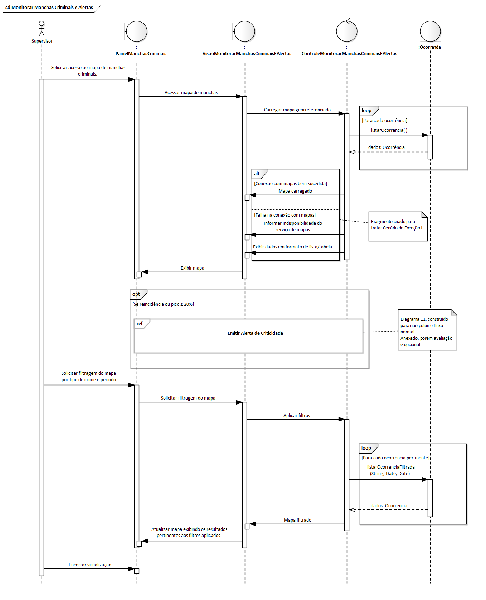

---

### UC06 — Vincular Ocorrências a Inquéritos (RF06)

* **Identificação:** UC06 — Vincular Ocorrências a Inquéritos
* **Resumo:** Descreve o agrupamento de uma ou mais ocorrências policiais em um inquérito policial (IP), permitindo a consolidação de investigações complexas.
* **Ator Principal:** Delegado de Polícia / Escrivão
* **Atores Secundários:** —
* **Pré-condições:** 
  1. As ocorrências devem estar com status `Validada`.
  2. O inquérito policial deve estar formalmente aberto no sistema.
* **Pós-condições:** As ocorrências ficam vinculadas ao inquérito e seu histórico consolidado.

#### Cenário Principal

| Passo | Ações do Ator | Ações do Sistema |
| :---: | :--- | :--- |
| 1 | Acessar o módulo de Gestão de Inquéritos e selecionar o inquérito desejado. | |
| 2 | Selecionar a opção `Vincular Ocorrências`. | |
| 3 | | Apresentar mecanismo de busca e sugestões de conexões automáticas (mesmo suspeito, local ou arma). |
| 4 | Selecionar as ocorrências a serem vinculadas e confirmar a operação. | |
| 5 | | Validar se as ocorrências já não se encontram vinculadas a outro inquérito principal ativo. |
| 6 | | Registrar a vinculação e unificar a linha temporal de evidências e envolvidos no inquérito. |
| 7 | | Exibir confirmação e atualizar a árvore de conexões do caso. |

#### Regras de Negócio e Validações
1. Uma ocorrência só pode estar vinculada como fato principal a um único inquérito policial.
2. O sistema deve sugerir automaticamente vínculos com base em cruzamento de dados de CPF, apelidos, placas de veículos e geolocalização comum.

#### Cenários Alternativos e de Exceção
* **Cenário de Exceção I — Ocorrência Já Vinculada:** O sistema alerta o usuário que a ocorrência já pertence a outro inquérito e permite vincular apenas como referência documental/cruzada.

#### Diagrama de Sequência — UC06
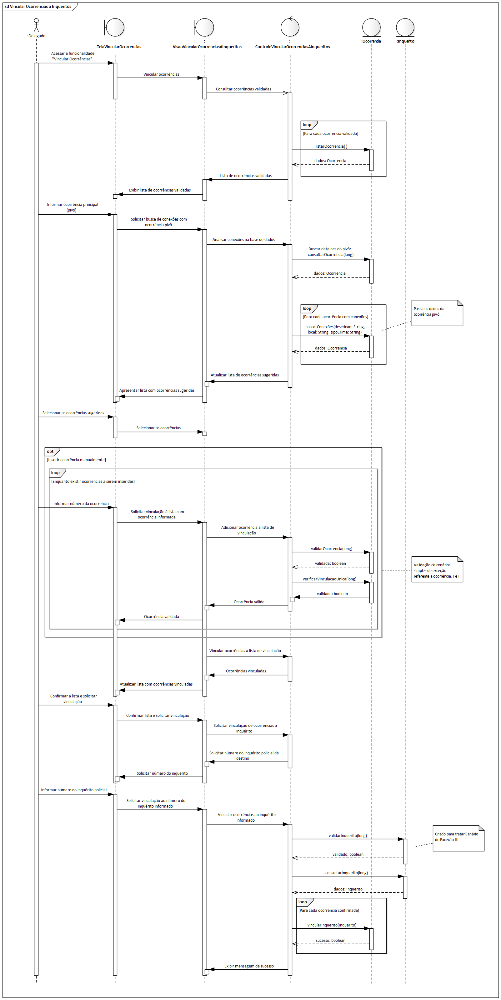

---

### UC07 — Manter Laudos Periciais (RF07)

* **Identificação:** UC07 — Manter Laudos Periciais
* **Resumo:** Descreve a solicitação, tramitação, confecção e anexação de laudos periciais emitidos pela Polícia Científica vinculados a itens apreendidos ou a ocorrências.
* **Ator Principal:** Perito Criminal / Delegado
* **Atores Secundários:** —
* **Pré-condições:** Ocorrência validada com auto de apreensão ou solicitação pericial aberta.
* **Pós-condições:** O laudo pericial é anexado com assinatura digital válida e torna-se imutável.

#### Cenário Principal

| Passo | Ações do Ator | Ações do Sistema |
| :---: | :--- | :--- |
| 1 | O Delegado emite a requisição de perícia indicando os quesitos e itens a serem periciados. | |
| 2 | | Notificar o departamento de Perícia Técnica e registrar a requisição pericial. |
| 3 | O Perito Criminal acessa a requisição, realiza a análise e redige o laudo pericial. | |
| 4 | O Perito faz o upload do arquivo final do laudo assinado digitalmente. | |
| 5 | | Validar o certificado digital do Perito e a integridade criptográfica do arquivo (RNF03). |
| 6 | | Vincular o laudo à requisição e à ocorrência correspondente. |
| 7 | | Atualizar o status pericial para `Laudo Concluído` e notificar a autoridade requisitante. |

#### Regras de Negócio e Validações
1. Todo laudo pericial anexado deve possuir assinatura digital válida (padrão ICP-Brasil ou token institucional).
2. O documento do laudo torna-se estritamente imutável após a juntada; qualquer retificação exige aditamento pericial fundamentado.

#### Cenários Alternativos e de Exceção
* **Cenário Alternativo I — Retificação de Laudo:** O Perito submete uma retificação formal que é adicionada como anexo aditivo sem apagar a versão original.
* **Cenário de Exceção I — Assinatura Digital Inválida:** O sistema rejeita o arquivo e emite erro indicando falha na validação do certificado.

#### Diagrama de Sequência — UC07
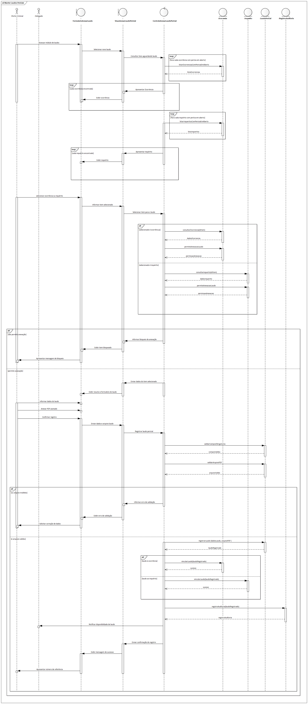

---

### UC08 — Autenticar Documento Policial (RF08)

* **Identificação:** UC08 — Autenticar Documento Policial
* **Resumo:** Descreve o processo público pelo qual um cidadão, advogado ou autoridade externa verifica a autenticidade e a validade de um documento gerado pelo sistema (Boletim de Ocorrência, certidão) por meio de chave de segurança.
* **Ator Principal:** Cidadão / Órgão Externo
* **Atores Secundários:** —
* **Pré-condições:** O usuário possui em mãos a chave alfanumérica ou o QR Code do documento impresso/digital.
* **Pós-condições:** O sistema exibe o resultado da conferência e disponibiliza o espelho do documento oficial para conferência.

#### Cenário Principal

| Passo | Ações do Ator | Ações do Sistema |
| :---: | :--- | :--- |
| 1 | Acessar o portal público de autenticação de documentos do SGOPI Sentinela. | |
| 2 | Digitar a chave de segurança de 24 caracteres ou escanear o QR Code. | |
| 3 | Submeter a consulta. | |
| 4 | | Buscar a chave na base de documentos emitidos. |
| 5 | | Verificar o hash de integridade e o status do documento (Válido, Retificado, Anulado). |
| 6 | | Exibir na tela os dados essenciais de conferência (Número do BO, data de emissão, unidade emissora e resumo dos fatos). |
| 7 | | Oferecer a opção de download da via oficial com marca d'água de autenticidade conferida. |
| 8 | | Registrar a consulta pública no log de auditoria do documento. |

#### Regras de Negócio e Validações
1. O portal público de autenticação não exige login, mas oculta dados pessoais sensíveis dos envolvidos (CPF, telefones, endereços) em respeito à LGPD e ao RNF02.
2. Documentos anulados ou sob segredo de justiça judicial exibem aviso específico de indisponibilidade para consulta pública.

#### Cenários Alternativos e de Exceção
* **Cenário de Exceção I — Chave Inexistente ou Incorreta:** O sistema exibe mensagem de alerta informando que o documento não foi localizado e orienta o cidadão a procurar a delegacia emissora.
* **Cenário de Exceção II — Documento com Status Inválido/Adulterado:** O sistema alerta sobre a inconsistência e grava registro de auditoria com prioridade de suspeita de fraude.

#### Diagrama de Sequência — UC08
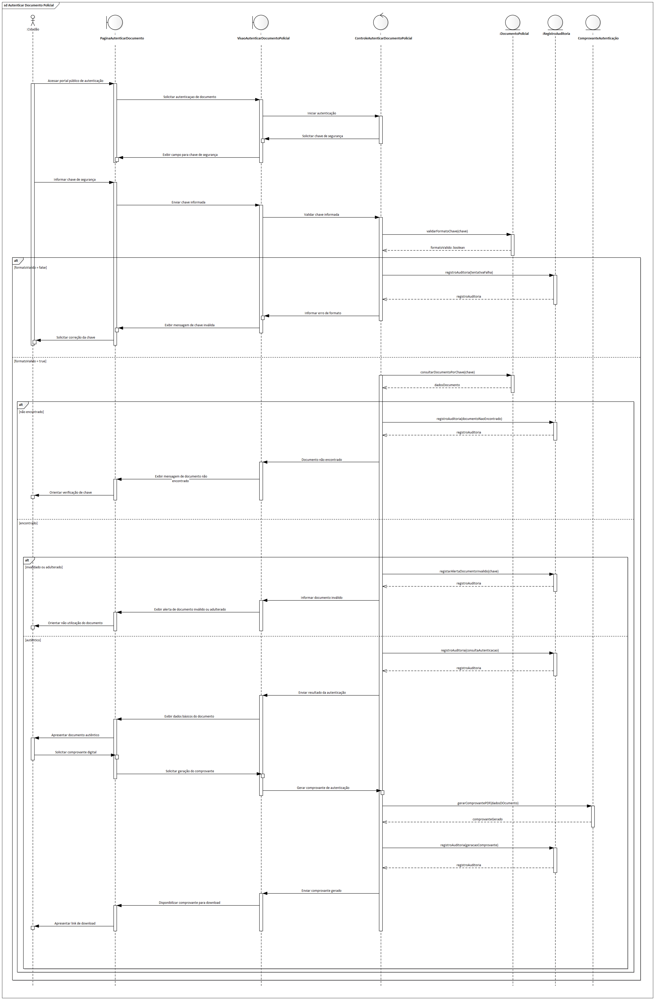

---

### UC09 — Manter Medidas Protetivas (RF09)

* **Identificação:** UC09 — Manter Medidas Protetivas
* **Resumo:** Descreve o cadastramento, acompanhamento de prazos, controle de cumprimento e renovação de medidas protetivas de urgência vinculadas a indivíduos.
* **Ator Principal:** Delegado de Polícia
* **Atores Secundários:** —
* **Pré-condições:** Ocorrência policial envolvendo vítima em situação de vulnerabilidade/violência doméstica registrada no sistema.
* **Pós-condições:** A medida protetiva é cadastrada com seus prazos de vigência e restrições ativas.

#### Cenário Principal

| Passo | Ações do Ator | Ações do Sistema |
| :---: | :--- | :--- |
| 1 | Acessar o módulo de Medidas Protetivas e selecionar `Cadastrar Medida Protetiva`. | |
| 2 | Selecionar a ocorrência e qualificar a vítima e o agressor. | |
| 3 | Informar os tipos de restrições concedidas (afastamento do lar, distância mínima, proibição de contato). | |
| 4 | Informar o prazo de vigência determinado pela autoridade judicial/policial. | |
| 5 | Confirmar o cadastro. | |
| 6 | | Validar os prazos e registrar a medida protetiva com status `Ativa`. |
| 7 | | Agendar os gatilhos de monitoramento de vencimento (UC12). |
| 8 | | Gerar termo de ciência e certidão de medida protetiva. |

#### Regras de Negócio e Validações
1. Apenas Delegados podem homologar ou revogar medidas protetivas.
2. O prazo de vigência é obrigatório e não pode ser retroativo.
3. Se um indivíduo com medida protetiva ativa constar em nova ocorrência com a mesma vítima, o sistema emite alerta imediato de descumprimento de ordem judicial.

#### Cenários Alternativos e de Exceção
* **Cenário Alternativo I — Renovação / Prorrogação de Medida:** O Delegado seleciona uma medida próxima do vencimento e cadastra a prorrogação autorizada pelo juízo.
* **Cenário de Exceção I — Descumprimento Detectado:** O sistema identifica violação de perímetro ou reincidência e gera notificação prioritária para a Central de Despacho.

#### Diagrama de Sequência — UC09
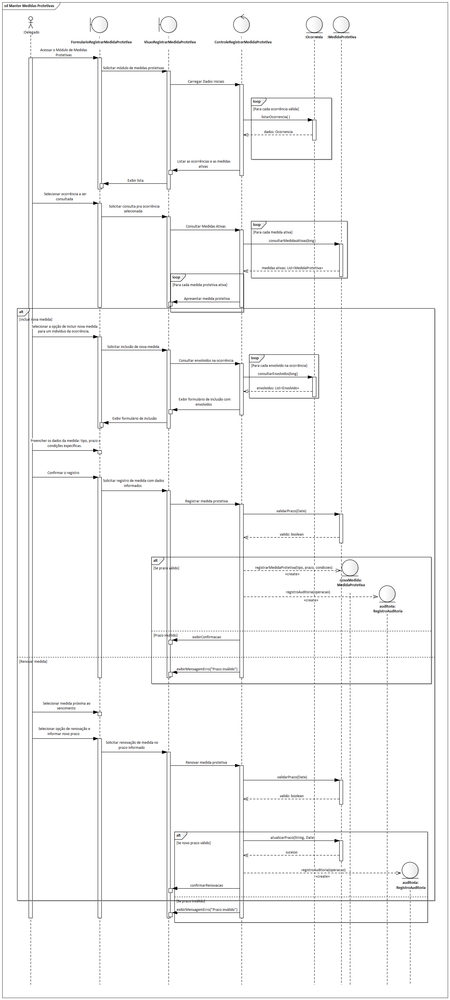

---

### UC10 — Comunicação Interagências (RF10)

* **Identificação:** UC10 — Comunicações Interagências
* **Resumo:** Descreve a troca formal e sigilosa de despachos, pedidos de apoio e documentos operacionais entre diferentes forças e departamentos de segurança (Polícia Civil, Militar, Perícia).
* **Ator Principal:** Agente / Delegado Requisitante
* **Atores Secundários:** Departamento Destinatário
* **Pré-condições:** Existência de protocolo de ocorrência ou inquérito de referência.
* **Pós-condições:** A mensagem oficial é registrada com protocolo, entregue ao departamento destinatário e auditada.

#### Cenário Principal

| Passo | Ações do Ator | Ações do Sistema |
| :---: | :--- | :--- |
| 1 | Acessar o módulo de Comunicações Interagências e clicar em `Nova Comunicação`. | |
| 2 | Informar o número do protocolo da ocorrência/inquérito de referência. | |
| 3 | Selecionar o departamento de destino (ex: 2ª Cia Batalhão PM, Instituto de Criminalística). | |
| 4 | Definir o nível de sigilo (Padrão, Reservado, Confidencial). | |
| 5 | Redigir o conteúdo da mensagem e anexar relatórios ou evidências. | |
| 6 | Confirmar o envio formal. | |
| 7 | | Validar os campos obrigatórios e registrar o despacho na thread do caso com carimbo de tempo. |
| 8 | | Enviar notificação em tempo real para a caixa de entrada do departamento destinatário. |
| 9 | | Registrar o evento de envio no log de auditoria com assinatura digital do remetente. |

#### Regras de Negócio e Validações
1. Toda comunicação interagências deve obrigatoriamente estar vinculada a um protocolo oficial existente.
2. Mensagens com nível `Confidencial` só podem ser lidas por usuários com credencial compatível da agência destinatária.
3. Não é permitida a exclusão de mensagens após o envio (imutabilidade do RNF03).

#### Cenários Alternativos e de Exceção
* **Cenário Alternativo I — Resposta / Despacho da Agência Destinatária:** O operador do departamento de destino abre a thread e envia a resposta com o relatório solicitado.
* **Cenário de Exceção I — Protocolo Inexistente:** O sistema valida o protocolo e recusa o envio até que um protocolo válido seja inserido.
* **Cenário de Exceção II — Falha de Conexão na Entrega:** O sistema registra a mensagem localmente, define o status da entrega como `Pendente` e agenda retentativas automáticas via mensageria assíncrona (RNF04).

#### Diagrama de Sequência — UC10
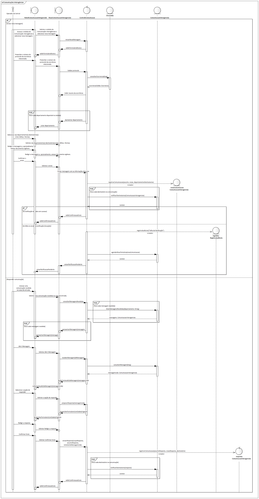

---

### UC11 — Emitir Alerta de Criticidade (RF05)

* **Identificação:** UC11 — Emitir Alerta de Criticidade
* **Resumo:** Descreve o processo automatizado em que o sistema monitora continuamente a base de dados de ocorrências para identificar padrões de alta criticidade e disparar notificações imediatas aos supervisores.
* **Ator Principal:** Sistema (Gatilho Automático) / Supervisor (Receptor)
* **Atores Secundários:** —
* **Pré-condições:**
  1. Parâmetros de criticidade configurados no sistema.
  2. Ocorrências com dados de geolocalização e suspeitos cadastradas.
  3. Padrão de criticidade atingido (ex: suspeito identificado em mais de 3 ocorrências na mesma semana ou aumento > 20% no volume de crimes em uma mancha criminal num intervalo de 24h).
* **Pós-condições:** 
  1. O alerta é exibido em destaque sonoro e visual no terminal do Supervisor.
  2. O evento de alerta é registrado no log de auditoria com carimbo imutável.

#### Cenário Principal

| Passo | Ações do Ator | Ações do Sistema |
| :---: | :--- | :--- |
| 1 | | O sistema analisa os dados recém-carregados e detecta que o limiar de criticidade foi atingido. |
| 2 | | Gerar notificação estruturada de alerta contendo resumo do padrão identificado, envolvidos e mapa. |
| 3 | | Registrar a emissão do alerta no banco de dados (Log / Auditoria). |
| 4 | | Disparar o alerta em destaque modal/push na tela do Supervisor. |
| 5 | O Supervisor avalia as informações e clica em `Confirmar Ciência`. | |
| 6 | | Registrar a ciência do Supervisor com data/hora e retomar a visualização do painel. |

#### Regras de Negócio e Validações
1. O alerta visual deve permanecer em destaque prioritário até que uma ação expressa de ciência seja executada pelo Supervisor.
2. Toda emissão de alerta é gravada de forma imutável para posterior avaliação da eficácia da inteligência criminal policial.

#### Cenários Alternativos e de Exceção
* **Cenário Alternativo I — Encaminhamento Imediato para Reforço Policial:** O Supervisor aciona diretamente o módulo de despacho (UC02) a partir da tela de alerta para direcionar viaturas para a zona crítica.

#### Diagrama de Sequência — UC11
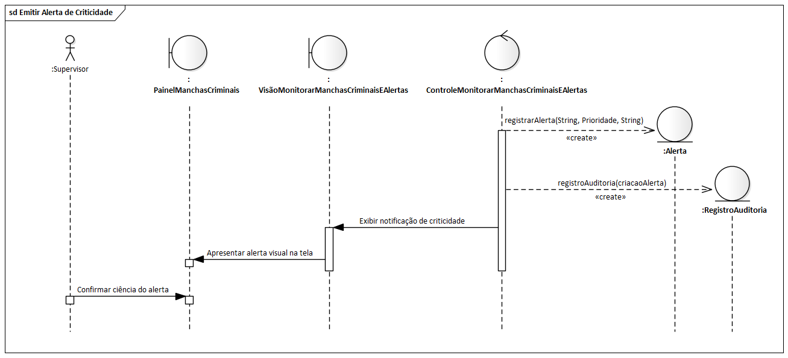

---

### UC12 — Emitir Alerta de Vencimento de Medida (RF09)

* **Identificação:** UC12 — Emitir Alerta de Vencimento de Medida
* **Resumo:** Processo automatizado executado em rotina de background que monitora diariamente as medidas protetivas ativas e notifica os delegados responsáveis quando uma medida atinge 72 horas antes do prazo final de expiração.
* **Ator Principal:** Ator Tempo / Sistema
* **Atores Secundários:** Delegado de Polícia (notificado)
* **Pré-condições:** Devem existir medidas protetivas cadastradas com status `Ativa`.
* **Pós-condições:** O alerta é gravado e visualizado pelo Delegado, prevenindo desassistência jurídica à vítima.

#### Cenário Principal

| Passo | Ações do Ator | Ações do Sistema |
| :---: | :--- | :--- |
| 1 | | Iniciar a rotina diária de checagem de prazos de medidas protetivas ativas. |
| 2 | | Consultar a base em busca de registros com vencimento programado para as próximas 72 horas. |
| 3 | | Identificar o Delegado responsável pela medida protetiva original. |
| 4 | | Gerar alerta de `Vencimento Próximo` contendo protocolo, nome do protegido e do agressor. |
| 5 | | Disparar notificação visual e sonora para o terminal do Delegado identificado. |
| 6 | | Registrar a emissão do alerta no log de auditoria da medida protetiva. |

#### Regras de Negócio e Validações
1. O alerta deve ser emitido exatamente uma vez para cada medida ao atingir a marca de 72h antes do término.
2. Caso o Delegado não esteja conectado no momento do disparo, a notificação permanece pendente e é apresentada em destaque imediatamente após o próximo login.

#### Cenários Alternativos e de Exceção
* **Cenário de Exceção I — Falha no Serviço de Notificações:** O sistema detecta falha interna, registra o erro no log e agenda retentativa automática no próximo ciclo (1 hora).
